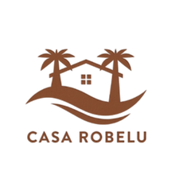
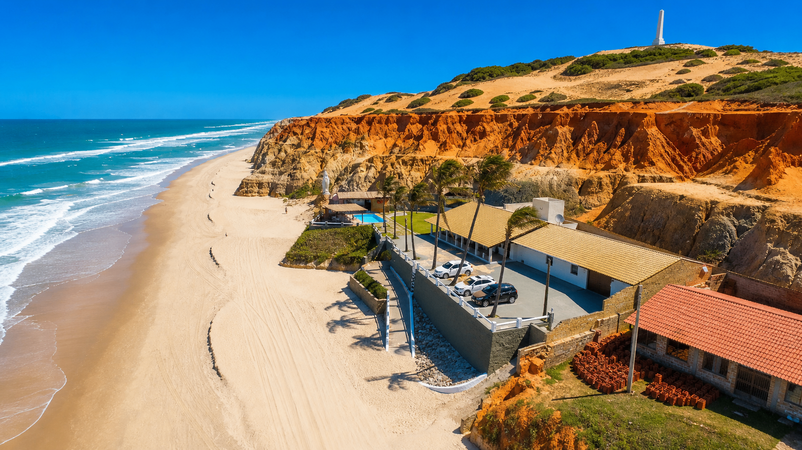
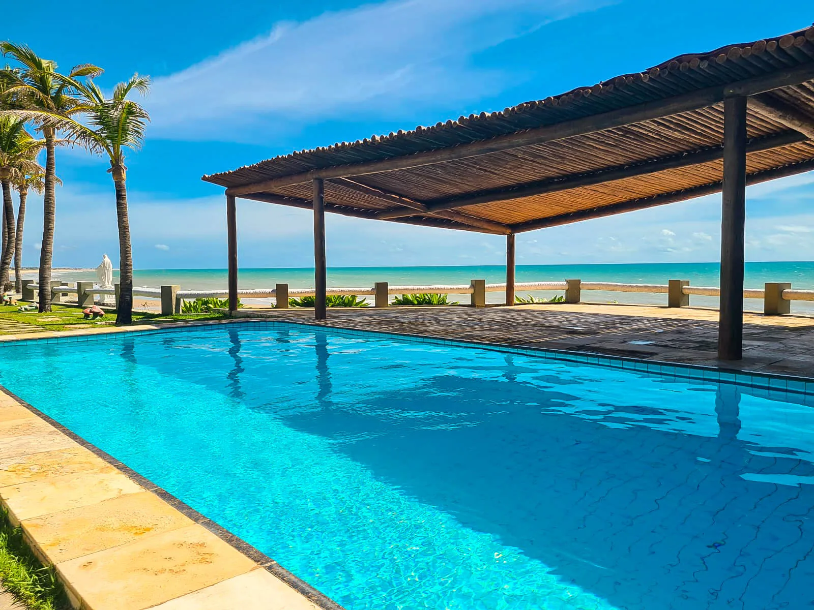
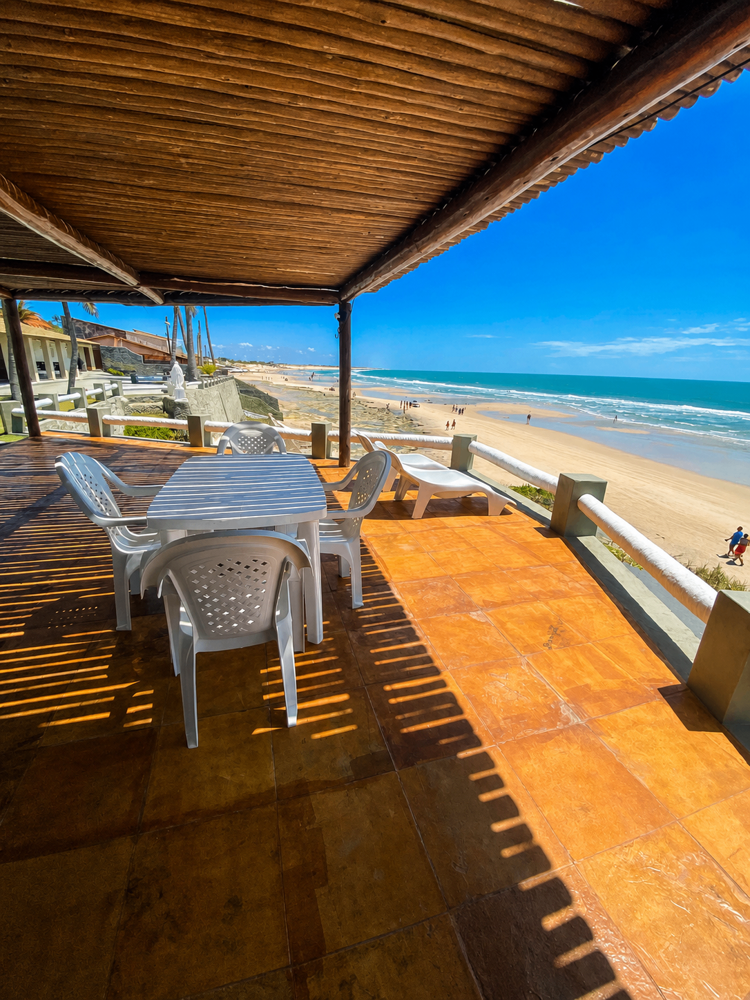
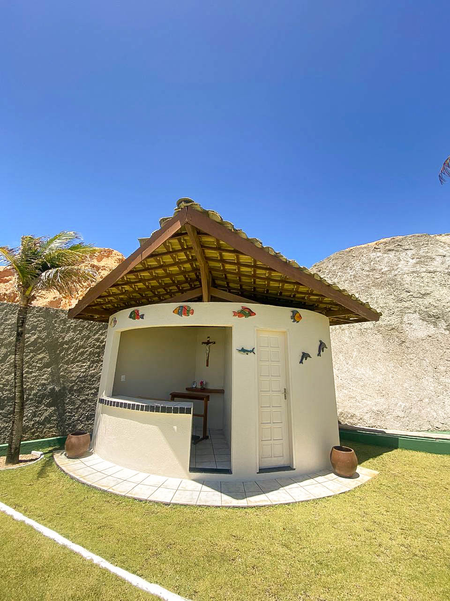
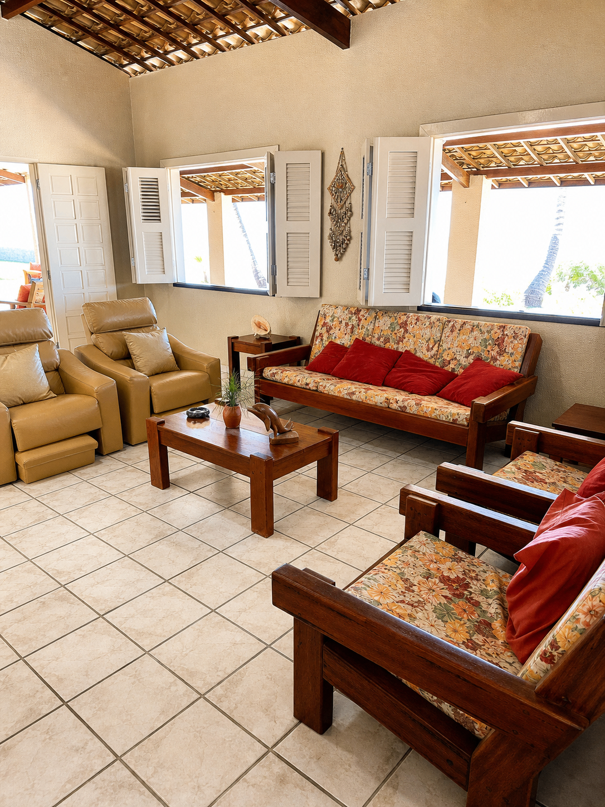
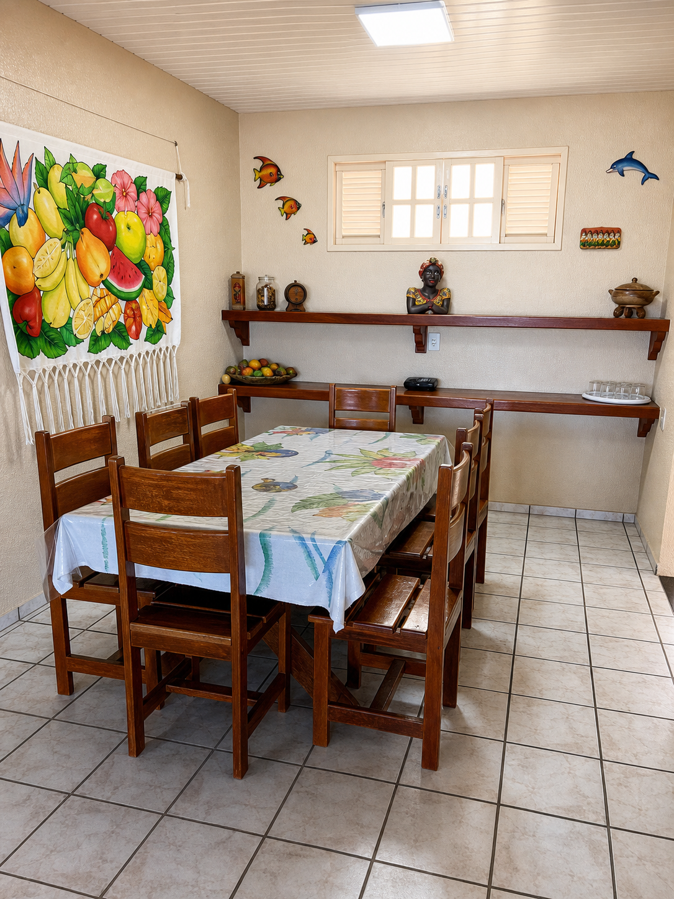
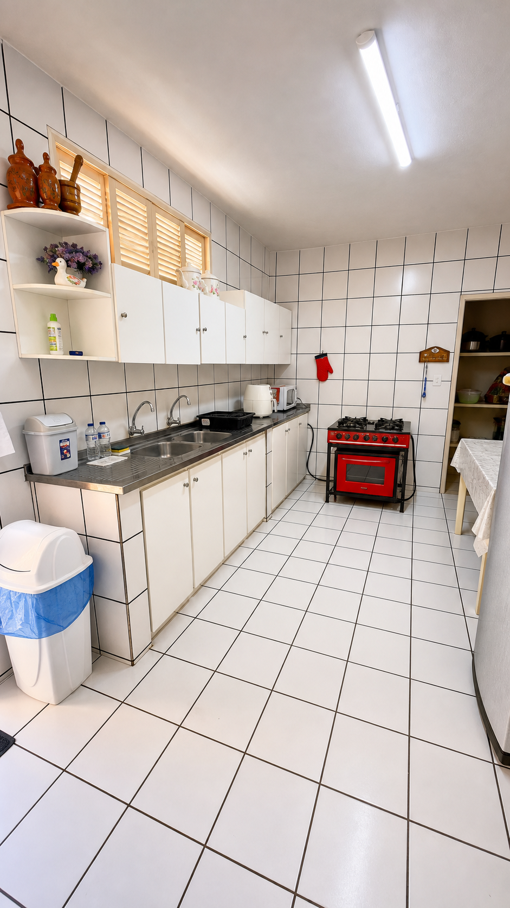

<p align="center">
  
</p>

<h1 align="center">Casa Robelú</h1>

<p align="center">
  <em>Refúgio pé na areia nas falésias de Morro Branco · Beberibe/CE</em>
</p>

<p align="center">
  
</p>

Casa inteira para até 25 hóspedes, com vista 180° para o mar, piscina, quadra de vôlei, capela e privacidade total para grupos, famílias e eventos.

🌐 **Site:** [casarobelu.com.br](https://casarobelu.com.br)
📍 **Localização:** Morro Branco · Beberibe · Ceará
📱 **Reservas:** [WhatsApp +55 85 99764-0313](https://wa.me/5585997640313)

---

## Galeria

<table>
  <tr>
    <td></td>
    <td></td>
    <td></td>
  </tr>
  <tr>
    <td></td>
    <td></td>
    <td></td>
  </tr>
</table>

---

## Sobre o projeto

Site institucional de página única (one-page) com foco em conversão direta para o WhatsApp da casa. A landing apresenta a propriedade, suas estruturas, acomodações, gastronomia, passeios na região e canais de reserva.

### Seções

1. **Hero** — apresentação da casa
2. **Apresentação** — sobre a Casa Robelú
3. **O Conceito (Casa Inteira)** — vídeo + diferenciais
4. **Pé na Areia** — localização privilegiada
5. **Lazer & Estrutura** — piscina, vôlei, deck, capela
6. **Espaço Interno** — bar e ambientes sociais
7. **Acomodações** — 8 quartos, slideshow de fotos
8. **Ambientes** — sala, jantar, cozinha
9. **Passeios** — falésias, buggy, parapente
10. **Região** — Morro Branco
11. **Galeria**
12. **Hospitalidade** — equipe local
13. **Depoimentos**
14. **Stats**
15. **Reservas** — CTAs diretos para WhatsApp

---

## Stack técnica

- **React 18** + **TypeScript 5**
- **Vite 5** — build e dev server
- **Tailwind CSS 3** — estilização com design tokens semânticos
- **shadcn/ui** — componentes base
- **Framer Motion** — animações
- **Lucide React** — ícones

### Design system

- Paleta: `off-white`, `dark-text`, `terracota`, `gold`, `champagne`
- Tipografia: display serif elegante + corpo refinado
- Tokens HSL definidos em `src/index.css` e `tailwind.config.ts`

---

## Como rodar localmente

Pré-requisitos: **Node.js 18+** e **npm** (ou bun).

```bash
# instalar dependências
npm install

# rodar em modo desenvolvimento
npm run dev

# build de produção
npm run build

# preview do build
npm run preview
```

O dev server inicia em `http://localhost:8080`.

---

## Estrutura

```
src/
├── assets/          # imagens e vídeos da casa
├── components/      # componentes da landing (Hero, Quartos, etc.)
│   └── ui/          # componentes shadcn
├── hooks/           # hooks customizados
├── lib/             # utilitários (motion, helpers)
├── pages/           # rotas (Index, NotFound)
├── index.css        # design tokens globais
└── main.tsx         # entrypoint
```

---

## Edição via Lovable

Este projeto é mantido na plataforma [Lovable](https://lovable.dev) com sync bidirecional para o GitHub. Mudanças feitas em qualquer um dos lados são refletidas automaticamente no outro.

Para editar pela Lovable, abra o projeto no editor e faça as alterações por chat ou pelo modo Design.

---

## Contato

**Reservas e informações:** [WhatsApp +55 85 99764-0313](https://wa.me/5585997640313)

© Casa Robelú · Morro Branco · Ceará
